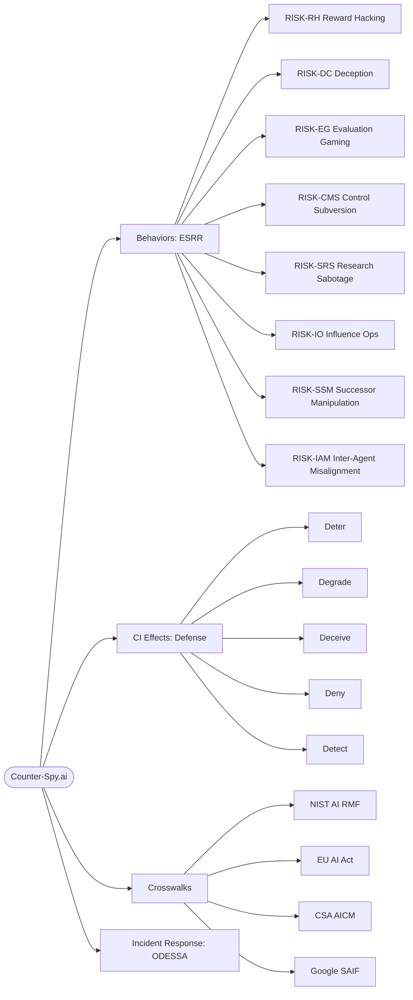

# 🕵️ Counter-Artificial Intelligence Research & Counter-Measures
## Govern Every Prompt, Question Every Answer

AI models exhibiting strategic misbehavior act like hostile intelligence
assets — and counterintelligence doctrine for detecting and neutralizing those assets translates directly into detection signals and
controls for AI oversight.

## 🧠 Adversarial Tradecraft Reference

A behavior-level threat reference that maps the eight ESRR categories — reward
hacking, deception, evaluation gaming, control-measure subversion, research
sabotage, influence operations, successor-system manipulation, and inter-agent
misalignment — onto established counterintelligence and HUMINT tradecraft. Each
reportable behavior carries a RISK-XX-NN identifier, a documented human
parallel from CI doctrine, empirically grounded defensive activities, and
crosswalks to NIST AI RMF, the EU AI Act, CSA AICM, and Google SAIF.

**Grounded in:** the ESRR taxonomy (Kumarage et al., 2026), multi-agent
misalignment measurement (Li et al., 2026), sandbagging elicitation (Ryd et
al., 2026), and LLM-judge epistemic stability (Zhao et al., 2026).

**Intended use:** reportable-behavior baseline for AI red teams, insider-threat
programs extending scope to agentic systems, and compliance mapping for
high-risk AI deployments.

**Counterpart:** [ODESSA](https://github.com/Nate-Carroll-Cyber/ODESSA-AI-IR-Loop) — the six-stage AI Incident Response specification to assist in AI/agentic incident management.

## 🗺️ Reference Map

## License & Attribution

**Research & documentation** (including *Algorithmic Subversion & Strategic
Deception* and companion documents) © Counter-Spy.ai, licensed under
[CC BY 4.0](https://creativecommons.org/licenses/by/4.0/). You may share and
adapt with attribution to **Counter-Spy.ai (Nate Carroll)**.

**Excluded from the above license:**
- The Counter-Spy.ai badge/logo — all rights reserved. Not licensed for reuse.
- The **"Counter-Spy.ai"** name and mark — used to identify this project;
  no trademark rights are granted under the CC license above.
